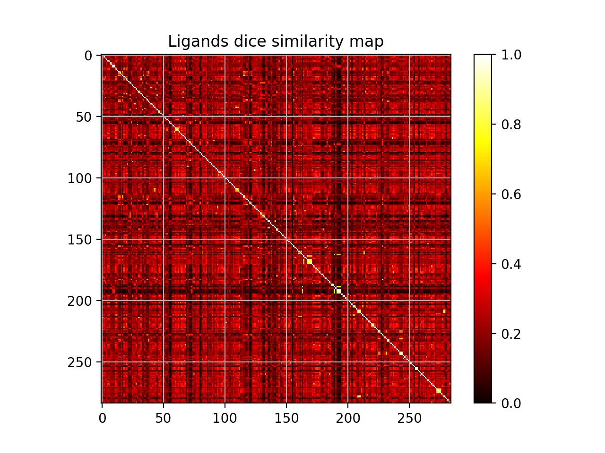
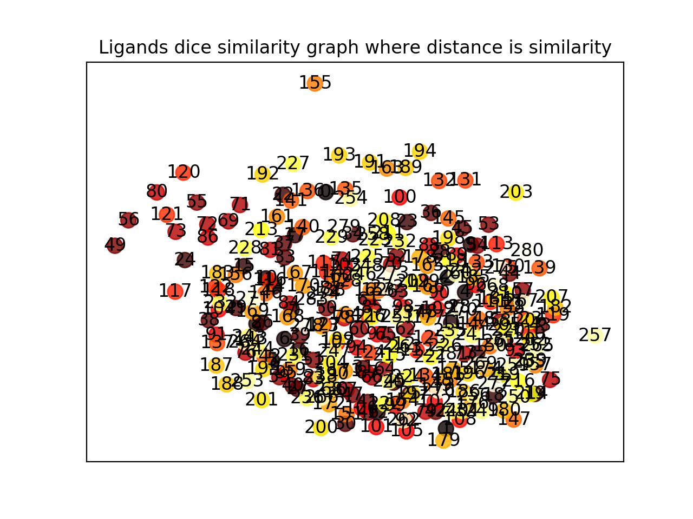
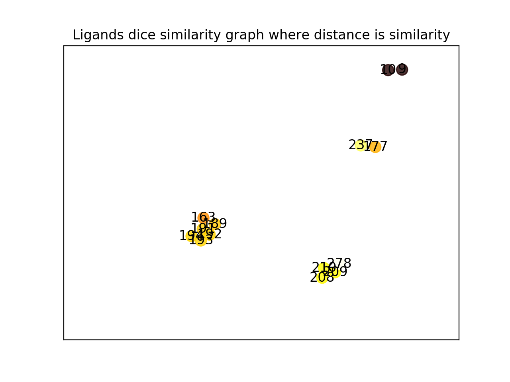

# Description
Finding similarities and redundancy in chemical data sets.

# Installation

```bash
git clone https://github.com/moozeq/DD_Redun.git

cd DD_Redun
git submodule update --init --recursive
pip3 install -r requirements.txt
```

## Prepare database

### Ligands

1. Download PDBBind database (e.g. [CASF-2016](http://www.pdbbind.org.cn/casf.asp)) and move its `coreset` to `DD_Redun/coreset` (you may also used pre-built database from [demo/db.smi](demo/db.smi), in that case skip to *4*)
    ```bash
    # move coreset from CASF-2016
    mv CASF-2016/coreset .

    # or use pre-built database from demo and skip to 4
    cp demo/db.smi .
    ```
2. In case of **CASF-2016** you may need to remove **4mme** complex, because ligand from this complex is causing error when creating fingerprints:
    ```bash
    rm -rf coreset/4mme
    ```
3. Run script from below (simply getting smiles and id for each ligand):
    ```bash
    for f in `ls coreset/`; do obabel -imol2 coreset/${f}/${f}_ligand.mol2 -osmi | awk '{print $1" "$2}' >> db.smi; done
    ```
4. Database should be at `DD_Redun/db.smi`
5. For docking functionality whole `coreset` folder must be under `DD_Redun/coreset` directory

### Receptors

6. Run script from below (simply merging all x_pocket.pdb files into one file database) or use pre-built database from [demo/prots.pdb](demo/prots.pdb):
    ```bash
    # generate prots database
    for f in `ls coreset/`; do cat coreset/${f}/${f}_pocket.pdb >> prots.pdb; done
    
    # or use pre-built database from demo
    cp demo/prots.pdb .
    ```
7. Database should be at `DD_Redun/prots.pdb`
8. Build G-LoSA using clang or g++:
    ```bash
    g++ glosa.cpp -o glosa
    ```

## Requirements
### Main functionality
- [openbabel](http://openbabel.org/wiki/Main_Page)

### Scaffolds
- [strip-it](http://silicos-it.be.s3-website-eu-west-1.amazonaws.com/software/strip-it/1.0.2/strip-it.html)

### Docking
- [AutoDock Vina](http://vina.scripps.edu/)
- [ODDT](https://pythonhosted.org/oddt/)
- PDBBind coreset

### Receptors
- [G-LoSA](https://compbio.lehigh.edu/GLoSA/index.html)

# Usage

## Help
```bash
./redun.py -h
./scorun.py -h
./sredun.py -h
```

## Database file
```bash
./redun.py db.smi
./scorun.py db.smi [ints]
./sredun.py prots.pdb
```

## In pipeline
```bash
cat db.smi | ./redun.py
cat db.smi | ./scorun.py [ints]
cat prots.pdb | ./sredun.py
```

# Report

Report from project is available [here](docs/Report_PL.pdf) (in Polish).

<html>
<body>
    <div>
        <h4>Selected results plots</h4>
        <p></p>
        <p></p>
        <p></p>
    </div>
</body>
</html>